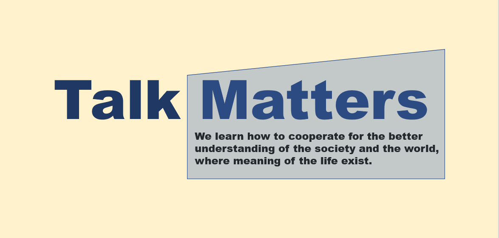

# TalkMatters
This is a project to find the meaning of the life while learning the world together with people.

  

> **We talk about the world, local, people, and life for the meaning of life**

## Mission Statement
* We learn how to cooperate for the better understanding of the society and the world, where meaning of the life exist.

## Seasons
* [Season 4](./Season4/README.md) - Sustainable and Expandable Education Platform for all Leaders <2020-12-17> ~ Until the end
* [Season 3](https://github.com/seock04/Uncertainty-Handler/wiki/Talk-matters-Season3) - Open role Talk show type meeting <2020-10-08> ~ <2020-12-10>
* [Season 2](https://github.com/seock04/Uncertainty-Handler/wiki/Talk-matters-Season2) - Talk show type meeting hosted by Hoseock <2020-07-14> ~ <2020-09-24>
* [Season 1](https://github.com/seock04/Uncertainty-Handler/wiki/Pathway-Level-4---Manage-Online-Meetings---Talk-matters-Season-1) - Online Discussion Meeting <2020-03-17> ~ <2020-07-07>

## Format
* [Original format of show introduction](https://github.com/seock04/TalkMatters/blob/main/TalkMatters_Original_Format.md)
* [Open Discussion type of show introduction](./TalkMatters_Open_Discussion_format.md)
* [Conference type of Pannel discussion introduction](./TalkMatters_Panel_Discussion_format.md)

